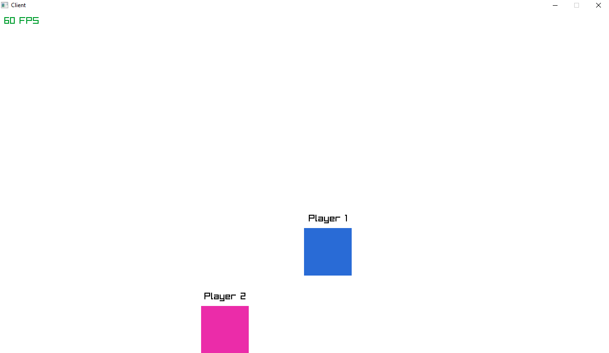

## INFO

This is my attempt of making a multiplayer server using C, while
also learning to use Github.

The project is concluded, I'll take this a win since this is my
first time using winsock or even the win32 api, The server though
is not great but it work so I'm moving on to a new project.

